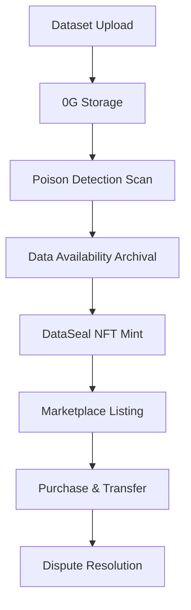

# DataShield
**Decentralised training data marketplace with cryptographic poison detection — built on 0G.**  
DataShield lets dataset uploaders certify training data via 0G Compute poison scans, mint an on-chain DataSeal quality certificate, and sell verified datasets to buyers using $0G.

##  Live Demo
- **Frontend**: `TODO_DEPLOY_URL`
- **Smart Contracts**: `TODO_AFTER_DEPLOY`
- **Explorer**: `https://chainscan-galileo.0g.ai/address/<CONTRACT_ADDRESS>`

## The Problem
AI training datasets are increasingly targeted by **data poisoning**: malicious samples, label flips, duplicate/backdoor triggers, and distribution anomalies that silently degrade model performance or embed backdoors.

Traditional solutions rely on centralized validators, creating single points of failure and trust issues. DataShield solves this by leveraging 0G's decentralized infrastructure for verifiable, trustless data quality certification.

## Architecture Overview

### Core Components
1. **Frontend** (Next.js 14): User interface for uploading, browsing, and purchasing datasets
2. **Backend** (Node.js/Express): Handles file uploads, scan queuing, and API endpoints
3. **Smart Contracts** (Solidity): DataSealNFT and DataMarket for on-chain certification and trading
4. **Scanner** (Python): AI-powered poison detection with 0G Compute integration
5. **0G Infrastructure**: Storage, Compute Network, Chain, and Data Availability layers

### Workflow


##  How It Works

### 1. **Upload & Storage**
- Uploader submits a dataset file (CSV format) through the frontend
- File is uploaded to 0G Storage, generating a Merkle root hash
- Backend queues the dataset for poison scanning

### 2. **Poison Detection**
- 0G Compute Network runs AI-powered poison detection scans
- Scanner performs three checks:
  - **Label Consistency**: Detects class imbalance anomalies
  - **Duplicate Injection**: Identifies near-duplicate samples (backdoor triggers)
  - **Text Outliers**: Flags text length anomalies
- Generates a cleanliness score (0-100) and detailed scan report

### 3. **Data Availability**
- Scan logs and results are archived on 0G Storage
- Generates a proof root for verifiable data availability
- Enables post-sale dispute resolution via DA replay

### 4. **DataSeal NFT Minting**
- Uploader bonds $0G tokens (minimum 100 $0G)
- Smart contract mints a DataSeal NFT with:
  - Dataset hash (Merkle root)
  - Scan result hash
  - Cleanliness score
  - Metadata (name, model type, sample count)
  - Bonded stake amount
- Oracle signature verifies scan authenticity

### 5. **Marketplace Listing & Purchase**
- NFT owner lists DataSeal on DataMarket contract
- Sets price in $0G tokens
- Buyers browse verified datasets, filter by score/model type
- Purchase transfers NFT and payment (minus protocol fee)
- Protocol fee (2.5%) goes to treasury

### 6. **Dispute Resolution**
- If post-sale poisoning is suspected:
  - Challenger submits proof via 0G Compute
  - Oracle evaluates evidence via AI verdict
  - If fraud proven: uploader's bond is slashed (50% to reporter, 50% burned)
  - DataSeal marked as slashed (cannot be traded)

## 0G Infrastructure Usage

| 0G Layer | DataShield Usage |
|-----------|------------------|
| **0G Storage** | Dataset uploads + scan log archival (DA demo) |
| **0G Compute Network** | LLM-powered listing generation and dispute verdicts |
| **0G Chain (EVM)** | DataSeal NFT + DataMarket settlement in $0G |
| **Data Availability** | Scan log proof root anchoring (archival + replay) |

## Smart Contracts

### DataSealNFT (`DataSealNFT.sol`)
ERC721 NFT representing certified datasets with bonded $0G stake.

**Key Features:**
- Mint with oracle-verified scan results
- Minimum score threshold (70/100)
- Minimum stake requirement (100 $0G)
- DA proof anchoring for dispute resolution
- Slashing mechanism for fraud detection
- View functions for seal metadata

**Struct:**
```solidity
struct DataSeal {
    bytes32 datasetHash;        // 0G Storage Merkle root
    bytes32 scanResultHash;    // Scan output hash
    bytes32 daProofRoot;       // DA proof root
    uint8 score;               // 0-100 cleanliness
    uint64 timestamp;
    address uploader;
    uint256 stake;             // Bonded $0G
    bool slashed;
    string datasetName;
    string modelType;
    uint256 sampleCount;
}
```

### DataMarket (`DataMarket.sol`)
Marketplace for trading DataSeal NFTs with $0G token payments.

**Key Features:**
- List, delist, and update prices
- Purchase with $0G token transfers
- Protocol fee (2.5%) to treasury
- Integration with DataSealNFT slashing status
- Non-reentrant purchase function
- View functions for active listings

## 🛠️ Tech Stack

### Contracts
- **Language**: Solidity 
- **Framework**: Foundry (forge/cast)
- **Libraries**: OpenZeppelin Contracts v4.9.6
- **Testing**: Forge tests

### Backend
- **Runtime**: Node.js 18+
- **Framework**: Express.js
- **Language**: TypeScript
- **Queue**: Bull (Redis)
- **Blockchain**: ethers v6, 0G TS SDK
- **File Handling**: Multer

### Frontend
- **Framework**: Next.js 14 (App Router)
- **Styling**: TailwindCSS
- **State**: React Query, wagmi + viem
- **Wallet**: wagmi connectors (MetaMask, Coinbase, Safe)
- **UI Components**: Radix UI, Framer Motion
- **Notifications**: Sonner

### AI/ML
- **Scanner**: Python 3, CSV analysis
- **0G Compute Models**: `qwen-2.5-7b-instruct` (testnet)
- **Detection**: Label consistency, duplicate injection, text outliers

## Local Development

### Prerequisites
- Node.js 18+
- Foundry (`forge`)
- Python 3.8+
- Redis (for queue system)
- 0G Testnet Access

### 1. Clone & Install
```bash
# Clone repository
git clone <repository-url>
cd DataSheild/datashield

# Install contract dependencies
cd contracts
forge install --no-git foundry-rs/forge-std OpenZeppelin/openzeppelin-contracts@v4.9.6

# Install backend dependencies
cd ../backend
npm install

# Install frontend dependencies
cd ../frontend
npm install
```

### 2. Environment Setup
Copy environment templates and configure:

```bash
# Copy environment templates
cp .env.example contracts/.env
cp .env.example backend/.env
cp .env.example frontend/.env.local

# Configure with your values:
# contracts/.env
OG_CHAIN_RPC="https://rpc-galileo.0g.ai"
PRIVATE_KEY="0x..."  # Deployer private key
ORACLE_PRIVATE_KEY="0x..."  # Oracle private key (must match backend)

# backend/.env
PORT=4000
OG_CHAIN_RPC="https://rpc-galileo.0g.ai"
DATASEAL_NFT_ADDRESS="0x..."  # After deployment
DATAMARKET_ADDRESS="0x..."    # After deployment
ORACLE_PRIVATE_KEY="0x..."    # Must match contracts

# frontend/.env.local
NEXT_PUBLIC_DATASEAL_ADDRESS="0x..."  # After deployment
NEXT_PUBLIC_DATAMARKET_ADDRESS="0x..."  # After deployment
NEXT_PUBLIC_BACKEND_URL="http://localhost:4000"
```

### 3. Deploy Contracts (0G Testnet)
```bash
cd contracts
set -a; source .env; set +a
forge script script/Deploy.s.sol:Deploy --rpc-url "$OG_CHAIN_RPC" --broadcast --private-key "$PRIVATE_KEY"
```

After deployment, update addresses in:
- `backend/.env` (`DATASEAL_NFT_ADDRESS`, `DATAMARKET_ADDRESS`)
- `frontend/.env.local` (`NEXT_PUBLIC_DATASEAL_ADDRESS`, `NEXT_PUBLIC_DATAMARKET_ADDRESS`)

### 4. Start Redis
```bash
# macOS (Homebrew)
brew install redis
brew services start redis

# Docker
docker run -d -p 6379:6379 redis:alpine

# Linux (apt)
sudo apt install redis-server
sudo systemctl start redis
```

### 5. Run Backend
```bash
cd backend
set -a; source .env; set +a
npm run dev
```

### 6. Run Frontend
```bash
cd frontend
set -a; source .env.local; set +a
npm run dev
```

### 7. Test Scanner
```bash
cd backend/src/scanner
python scanner.py test_dataset.csv
```

##  API Endpoints

### Backend (`localhost:4000`)

| Method | Endpoint | Description |
|--------|----------|-------------|
| `POST` | `/api/upload` | Upload dataset file for scanning |
| `GET` | `/api/scan/:jobId` | Get scan result by job ID |
| `GET` | `/api/listings` | Get marketplace listings (with filters) |
| `GET` | `/api/seal/:tokenId` | Get DataSeal NFT details |
| `POST` | `/api/anchor` | Anchor DA proof on-chain |

### Example Upload
```bash
curl -X POST http://localhost:4000/api/upload \
  -F "file=@dataset.csv" \
  -F "walletAddress=0x..."
```

## Testing

### Contract Tests
```bash
cd contracts
forge test -vv
```

### Scanner Tests
```bash
cd backend/src/scanner
python scanner.py ../test_data/clean_dataset.csv
python scanner.py ../test_data/poisoned_dataset.csv
```

### Integration Tests
1. Upload a dataset through the frontend
2. Monitor scan progress via job ID
3. Mint DataSeal NFT (requires testnet $0G)
4. List and purchase through marketplace

## Security Considerations

### Bonding & Slashing
- Uploaders must bond minimum 100 $0G
- Slashing occurs if post-sale poisoning is proven
- 50% of slashed funds go to reporter, 50% burned
- Prevents malicious uploads while incentivizing honest behavior

### Oracle Security
- Oracle private key must be secured
- Backend and contracts must use same oracle key
- Consider multi-sig or threshold signatures for production

### Data Privacy
- Dataset contents are stored on 0G Storage (decentralized)
- Only hashes and metadata are on-chain
- Buyers receive dataset access via 0G Storage proofs

## Future Roadmap

### Short-term (Q2 2025)
- [ ] Deploy to 0G Mainnet
- [ ] Integrate 0G Compute for AI-powered scans
- [ ] Add more dataset formats (JSON, Parquet)
- [ ] Implement batch uploads
- [ ] Enhanced scanner with ML models

### Medium-term (Q3 2025)
- [ ] Cross-chain compatibility (EVM chains)
- [ ] Advanced dispute resolution with multiple oracles
- [ ] Dataset versioning and updates
- [ ] API for third-party integrations
- [ ] Mobile application

### Long-term (Q4 2025+)
- [ ] Federated learning dataset certification
- [ ] Zero-knowledge proofs for privacy-preserving verification
- [ ] Decentralized autonomous organization (DAO) governance
- [ ] Insurance pool for disputed datasets
- [ ] Integration with major AI training platforms


### Development Guidelines
- Follow TypeScript/ESLint configuration
- Write tests for new features
- Update documentation for API changes
- Use conventional commits format


## Acknowledgments

- **0G Labs** for infrastructure and support
- **OpenZeppelin** for secure contract templates
- **Ethereum Foundation** for EVM ecosystem
- **All contributors** and early testers

##  Contact & Support

- **GitHub Issues**: [Repository Issues](https://github.com/your-org/datashield/issues)
- **Discord**: Join our community channel
- **Email**: supportdatashield@gmail.com
- **Twitter**: @DataShieldAI

---

**Built with ❤️ by the DataShield Team | Powered by 0G Infrastructure**